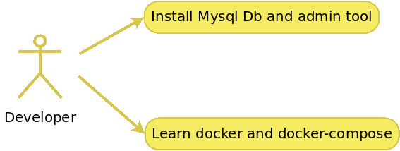
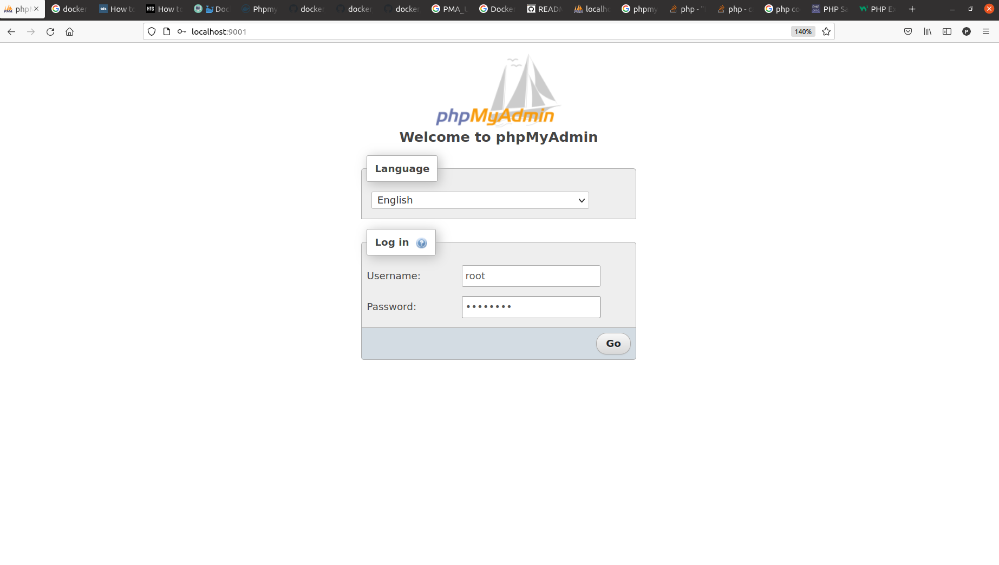
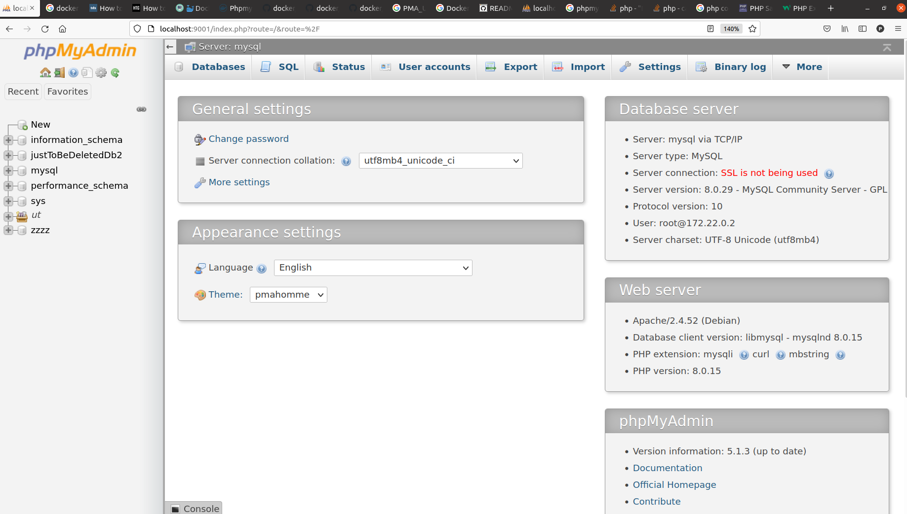
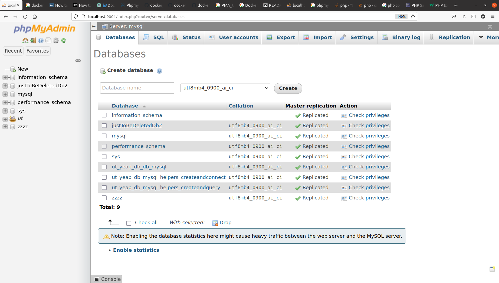

<div align="center">
    
</div>

# Intro
Mysql Db and phpmyadmin(or adminer)

---


# Use-cases
- As a developer I and need quckly setup Mysql Db with phpmyadmin
- As a developer I want learn docker adn docker-compose

<div align="center">
    
</div>

---


### Details
It's a docker-compose file containing next services:
```
$ docker-compose ps
   Name                 Command               State                          Ports                       
---------------------------------------------------------------------------------------------------------
mysql        docker-entrypoint.sh mysqld      Up      0.0.0.0:3306->3306/tcp,:::3306->3306/tcp, 33060/tcp
phpmyadmin   /docker-entrypoint.sh apac ...   Up      0.0.0.0:9001->80/tcp,:::9001->80/tcp  
```

---


### Cridentials
All cridentials to pg and pgadmin are located here in .env file\
If you want to change cridentials - simply edit .env

---


### To launch
```
$ docker-compose up
```

---


### To shutdown
```
$ docker-compose down
```

---


### Web services
- [localhost:9001](http://localhost:9001)\
    User: root\
    Password: test1234

---


### Screenshots

#### Login page
<div align="center">
    
</div>


#### Main view
<div align="center">
    
</div>


#### Databases view
<div align="center">
    
</div>

---


### Updating /etc/hosts
Here is a tool which uses docker events for updating /etc/hosts.\
Prior to launching docker-compose do this:
```
$ sudo apt update && sudo apt install jq
$ sudo bash ./docker-hosts-update.sh
```
Once this script is run it will append/remove entiries into /etc/hosts


#### Updating /etc/hosts(Option B)
```
$ echo "$(docker exec -it pgadmin sh -c "hostname -i" | head -c-2) $(docker exec -it pgadmin sh -c "hostname" | head -c-2)" | sudo tee -a /etc/hosts
$ echo "$(docker exec -it postgres sh -c "hostname -i" | head -c-2) $(docker exec -it postgres sh -c "hostname" | head -c-2)" | sudo tee -a /etc/hosts
```

